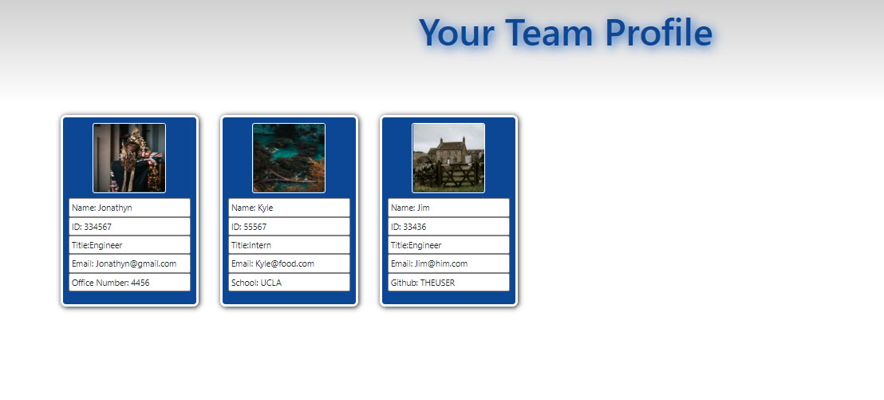
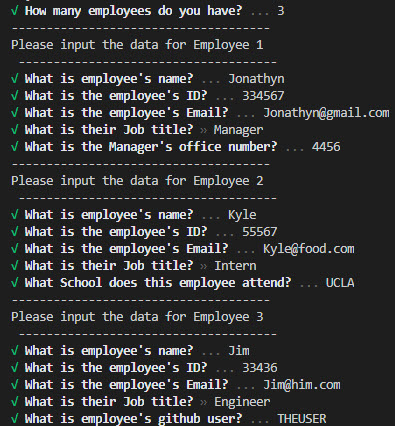
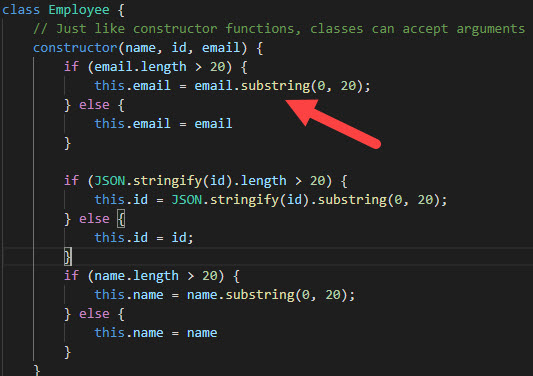

# hw10_teamBuilder

# TABLE OF CONTENTS
1) Introduction
2) Instructions
3) Additional Information

# Introduction
This node application allows a user to build a team profile by inputing data on the command line by running CLI.js

Once you are finished, a HTML document will be created providing a profile for your new team!
 

# Instructions
1) First run "node CLI.js" at the command line
2) select the number of employees that are on your team
3) Fill out each team members information
4) Open the newly generate "index.html"   
  

# Additional Information
1) There is no limit on the size of the team.
2) All character limits are 20 characters long.
